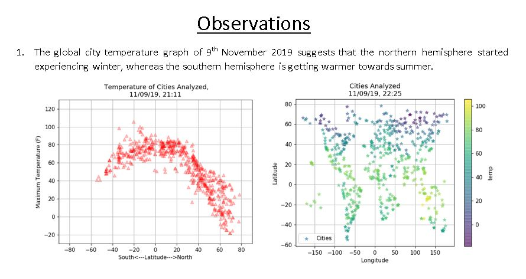
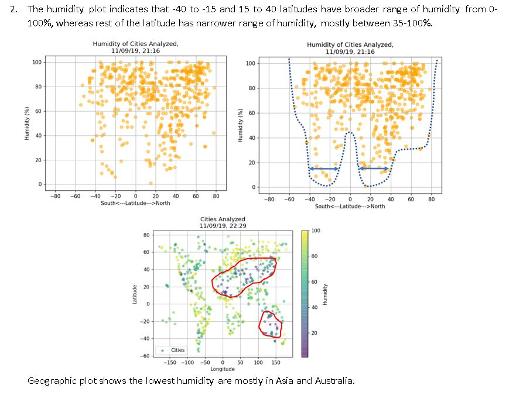
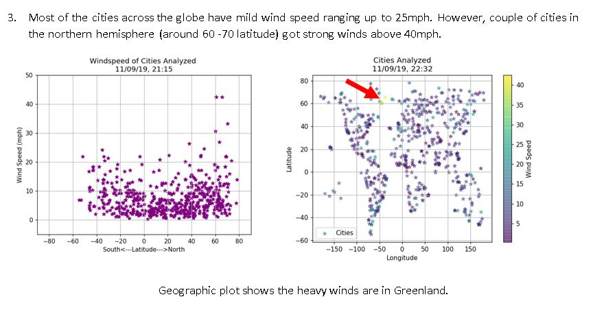

# A Python script to visualize the weather of 500+ cities across the world of varying distance from the equator.

Randomly select ~ 500 unique cities based on latitude and longitude.

Performed a weather check on each of the cities using a series of successive API calls.

Python library used -citipy 0.0.5

Weather API (https://openweathermap.org/api)

CSV (cities.csv) of data retrieved: contains detail of cities analyzed, saved in folder:- Python-api-challenge/WeatherPy/output_data/

Images : png images for each scatter plot saved in :- Python-api-challenge/WeatherPy/images/

Temperature (F) vs. Latitude

Humidity (%) vs. Latitude

Cloudiness (%) vs. Latitude

Wind Speed (mph) vs. Latitude

# Three trends based on the data

